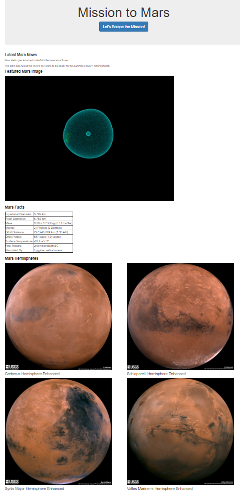

# WebScrapingandDatabases-NASA_Scraping_with_MongoDB
This web application scrapes various websites for data related to NASA's mission to Mars and displays the information in a single HTML page. 
### Web Scraping (Mission to Mars)
The [Mission to Mars.py](Mission_to_Mars/mars_scrape.py) file performs the following tasks:

* Scrapes the [NASA Mars News Site](https://mars.nasa.gov/news/) and collects the latest News Title and Paragraph Text and assigns the text to variables that you can be referenced later.
```python
# Example:

news_title = "NASA's Next Mars Mission to Investigate Interior of Red Planet"

news_p = "Preparation of NASA's next spacecraft to Mars, InSight, has ramped up this summer, on course for launch next May from Vandenberg Air Force Base in central California -- the first interplanetary launch in history from America's West Coast."
```
* Visits the url for JPL [Featured Space Image](https://www.jpl.nasa.gov/spaceimages/?search=&category=Mars).
* Uses splinter to navigate the site and finds the image url for the current Featured Mars Image and assigns the url string to a variable called `featured_image_url`.
```python
# Example:

featured_image_url = 'https://www.jpl.nasa.gov/spaceimages/images/largesize/PIA16225_hires.jpg'
```
* Visits the [Mars Facts webpage](https://space-facts.com/mars/) and use Pandas to scrape the table containing facts about the planet including Diameter, Mass, etc.
* Uses Pandas to convert the data to a HTML table string.
* Visits the [USGS Astrogeology site](https://astrogeology.usgs.gov/search/results?q=hemisphere+enhanced&k1=target&v1=Mars) to obtain high resolution images for each of Mar's hemispheres.
* Saves both the image url string for the full resolution hemisphere image, and the Hemisphere title containing the hemisphere name.
```python

# Example:

hemisphere_image_urls = [

{"title": "Valles Marineris Hemisphere", "img_url": "..."},

{"title": "Cerberus Hemisphere", "img_url": "..."},

{"title": "Schiaparelli Hemisphere", "img_url": "..."},

{"title": "Syrtis Major Hemisphere", "img_url": "..."},

]
```
* Returns a combined dictionary of all scraped data

### App (Flask)
* Establishes connection to "Mission to Mars" database.
* Scrapes through websites via [Mission to Mars.py](Mission_to_Mars/mars_scrape.py) file and inserts the combined dictionary into the "Mission to Mars" database.
* Displays the webpage, using information from the most recent database entry.
---
### Tech Stack
* HTML
* Python
* Bootstrap
* Jupyter Notebook
* MongoDB
* Splinter
* Beautiful Soup

### User Instructions
* Clone the repository: git clone https://github.com/DarrylB32/WebScrapingandDatabases-NASA_Scraping_with_MongoDB.git 
 * Using terminal, navigate to the folder that has the **app.py** file and input:
	* python app.py
 * Copy and paste the URL link into your browser


### Additional Notes
* If you wish to run a new web scraping session select the "Let's Scrape the Mission" icon